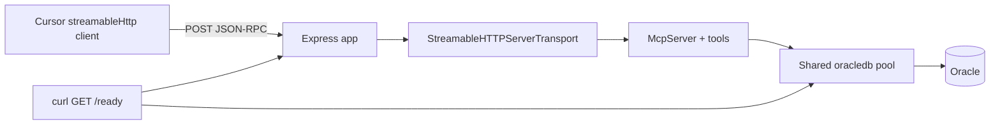

# Switch oracle-mcp to HTTP (Streamable MCP)

## Approach

Use the same pattern as the SDK example `[simpleStatelessStreamableHttp.js](oracle-mcp/node_modules/@modelcontextprotocol/sdk/dist/esm/examples/server/simpleStatelessStreamableHttp.js)`:

- `**createMcpExpressApp**` from `[@modelcontextprotocol/sdk/server/express.js](oracle-mcp/node_modules/@modelcontextprotocol/sdk/dist/esm/server/express.js)` (JSON body + optional DNS rebinding middleware for localhost).
- `**StreamableHTTPServerTransport**` with `**sessionIdGenerator: undefined**` (stateless; no session stickiness).
- On each `**POST**` to the MCP path: create a fresh `**McpServer**`, `**registerOracleTools(...)**`, `**await server.connect(transport)**`, `**await transport.handleRequest(req, res, req.body)**`, then on `**res.on('close', ...)**` call `**transport.close()**` and `**server.close()**` (same lifecycle as the example).




**Shared Oracle pool:** Create `**createPool(mcpCfg)` once at startup** and pass the pool into tool registration. Only the `**McpServer` + transport** are per request (matches SDK stateless example; acceptable overhead for a dev server).

## Code layout


| File                                                                       | Change                                                                                                                                                                                                                                                                                                                                                                                                                                   |
| -------------------------------------------------------------------------- | ---------------------------------------------------------------------------------------------------------------------------------------------------------------------------------------------------------------------------------------------------------------------------------------------------------------------------------------------------------------------------------------------------------------------------------------- |
| `[oracle-mcp/src/config.ts](oracle-mcp/src/config.ts)`                     | Extend parsed JSON with optional `**oracle.mcpHttp**`: `{ host?: string, port?: number, path?: string }`. Defaults: `**127.0.0.1**`, `**3111**`, `**/mcp**`. Export these as part of loaded config (e.g. extend `**OracleMcpConfig**` or a small `**McpHttpListenConfig**` returned alongside).                                                                                                                                          |
| `[oracle-mcp/src/tools.ts](oracle-mcp/src/tools.ts)` (new)                 | Move the three `**server.registerTool**` blocks from `[index.ts](oracle-mcp/src/index.ts)` into `**registerOracleTools(server, pool, mcpCfg)**` so HTTP handler stays small.                                                                                                                                                                                                                                                             |
| `[oracle-mcp/src/index.ts](oracle-mcp/src/index.ts)`                       | Replace stdio entry with: load config → `**createPool**` → build Express app → `**GET /ready**` (DB probe via `**executeStatement**`, see below) → optional `**GET /health**` (process-only) → `**POST {path}**` (and mirror the example’s `**GET`/`DELETE**` on `{path}` returning **405** JSON-RPC errors if the SDK example does so) → `**app.listen(port, host)**` → graceful `**SIGINT**`: close HTTP server + `**pool.close(0)**`. |
| `[oracle-mcp/src/oracle.ts](oracle-mcp/src/oracle.ts)`                     | Add `**probeOracleDb(pool)**` (or equivalent) that calls `**executeStatement**` with `**SELECT * FROM dual**`, `**maxRows: 1**`, same options as tools — single code path for “real query” checks.                                                                                                                                                                                                                                       |
| `[oracle-mcp/package.json](oracle-mcp/package.json)`                       | Add `**express**` (and `**@types/express**`) as **direct** dependencies so imports/types are stable (SDK already bundles express transitively, but direct deps avoid ambiguity). Keep `**npm run build**` / `**npm start**`; `**start**` runs the HTTP server.                                                                                                                                                                           |
| `[oracle-mcp/development.config.json](oracle-mcp/development.config.json)` | Document in README; optionally add an `**oracle.mcpHttp**` example block (user can paste; avoid committing secrets—only structure).                                                                                                                                                                                                                                                                                                      |


## Readiness and curl (DB-backed, same path as `execute_sql`)

**Primary operator check:** `**GET /ready**` (or `**/health/db**` — pick one name and document it). Handler uses the **shared pool** and `**executeStatement**` (or a thin `**probeOracleDb(pool)**` wrapper in `[oracle.ts](oracle-mcp/src/oracle.ts)`), **not** a second client — so success implies the same driver, pool, credentials, and network path MCP tools use.

- Default probe SQL: `**SELECT * FROM dual**`, `**maxRows: 1**`.
- **200** + JSON e.g. `**{"ok":true,"query":"SELECT * FROM dual","rowCount":1,"rows":[...]}**` (reuse the same JSON-safe serialization as tool responses if helpful).
- **503** (or **500**) + `**{"ok":false,"error":"..."}**` on Oracle or pool errors.

**Optional `GET /health`:** `**{"ok":true}**` with **no** DB call — only distinguishes “HTTP up” vs “DB down”; README should say `**/ready**` is the meaningful preflight.

**Why not curl the MCP POST body?** A full Streamable HTTP JSON-RPC `tools/call` sequence is verbose and client-specific. `**/ready**` is the practical “same as running a real query through this server” without duplicating the MCP wire format. **Cursor** still validates MCP end-to-end (tool list + `execute_sql`).

```bash
curl -s -i http://127.0.0.1:3111/ready
```

## Cursor configuration

Cursor supports HTTP MCP via `**streamableHttp**` / URL-style entries (exact field names vary slightly by Cursor version; README will describe both patterns):

- **URL:** `http://<host>:<port><path>` e.g. `**http://127.0.0.1:3111/mcp**`
- **No auth:** omit `**headers**` / tokens.
- Point users to **Cursor Settings → MCP** and/or `**.cursor/mcp.json**`, and note **restart Cursor** after changes.

## README (deliverable)

Rewrite `[oracle-mcp/README.md](oracle-mcp/README.md)` with explicit sections:

1. **Run the server** — `npm install`, `npm run build`, `npm start`; where `**development.config.json**` lives; meaning of `**oracle.mcpHttp**` defaults.
2. **Verify Oracle through this server** — `curl` to `**/ready**`; expect **200** and a row from `dual`; **503** + error JSON if DB unreachable or misconfigured. Optionally document `**/health**` for process-only.
3. **Configure Cursor** — start server first; add MCP server with **streamable HTTP** + full MCP URL; no headers for no-auth.
4. **Verify MCP in Cursor** — MCP panel shows server connected + tools `**execute_sql**`, `**list_tables**`, `**describe_table**`; test prompt: use `**execute_sql**` with `**SELECT * FROM dual**` in Agent mode.

Add a short **security note**: no auth and optional `**0.0.0.0**` binding are dev-only; do not expose to untrusted networks.

## Binding / DNS rebinding

- Default `**createMcpExpressApp()**` with `**host: '127.0.0.1'**` when listen host is localhost (SDK applies localhost host validation).
- If config sets `**host: '0.0.0.0'**` (LAN), use `**createMcpExpressApp({ host: '0.0.0.0', allowedHosts: [...] })**` per SDK docs, or accept the SDK console warning—README will mention `**allowedHosts**` if binding all interfaces.

