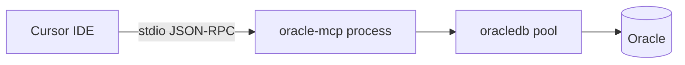

# Oracle MCP server for Cursor

## Context

- Repo `[C:\Repos\github\ai-dev](C:\Repos\github\ai-dev)` is empty of Node tooling today; this will be a **new subfolder** (e.g. `[oracle-mcp/](oracle-mcp/)`) containing the server.
- Cursor talks to MCP over **stdio** by default: your process reads/writes JSON-RPC on stdin/stdout.
- Oracle access: **node-oracledb** + existing Instant Client path; connection string from your earlier config maps to `connectString` in `createPool`.




## Implementation choices


| Choice                                     | Rationale                                                                                                                                                                                                               |
| ------------------------------------------ | ----------------------------------------------------------------------------------------------------------------------------------------------------------------------------------------------------------------------- |
| **TypeScript + `tsx` or compiled `dist/**` | Matches typical MCP examples; easier maintenance than raw JS.                                                                                                                                                           |
| `**@modelcontextprotocol/sdk**`            | Official SDK; `McpServer` + `StdioServerTransport`.                                                                                                                                                                     |
| `**oracledb**`                             | Standard Node driver; call `oracledb.initOracleClient({ libDir })` when using Thick mode (Instant Client).                                                                                                              |
| **Config**                                 | Environment variables for `ORACLE_USER`, `ORACLE_PASSWORD`, `ORACLE_CONNECT_STRING`, `ORACLE_CLIENT_LIB_DIR`, plus optional pool integers—keeps Cursor MCP config simple without committing secrets (even on a dev DB). |


## MCP tools to implement

For “full access” on a dev DB, expose a small set that covers structure and data:

1. `**execute_sql**` — Run arbitrary SQL (SELECT/INSERT/UPDATE/DDL as needed). Input: `sql` string, optional `binds` object/array for bind variables. Return: for queries, rows + column metadata; for DML/DDL, rows affected or success message. Use `connection.execute` / `executeMany` as appropriate.
2. `**list_tables**` — Optional convenience: query `ALL_TABLES` (or `USER_TABLES`) filtered by optional `owner` / `table_name` pattern so the model does not need to memorize catalog SQL.
3. `**describe_table**` — Optional: columns from `ALL_TAB_COLUMNS` (+ PK via `ALL_CONS_COLUMNS` / `ALL_CONSTRAINTS`) for a given `owner` + `table_name`.

You can start with **only `execute_sql**` and add 2–3 if you want faster, cheaper turns for schema questions.

## Project layout (proposed)

```
oracle-mcp/
  package.json
  tsconfig.json
  src/
    index.ts          # entry: init Oracle client, create pool, register tools, stdio transport
    oracle.ts         # pool lifecycle, execute helpers
    tools/            # optional split: executeSql.ts, schema.ts
  README.md           # build, env vars, Cursor MCP JSON snippet
```

## Key implementation details

1. **Startup sequence** in `[src/index.ts](oracle-mcp/src/index.ts)`: load env → `initOracleClient` if `ORACLE_CLIENT_LIB_DIR` set → `oracledb.createPool` → construct `McpServer` → register tool handlers that acquire `connection` from pool, run SQL, release → connect `StdioServerTransport`.
2. `**execute_sql**`: Accept one statement per call (or document that multiple statements are unsupported unless you implement splitting—simpler to require one statement). Map `OUT_FORMAT_OBJECT` for readable row JSON. Cap **maxRows** via env (e.g. default 10_000) to avoid accidental huge result sets freezing the IDE—even on dev DB this improves UX; you can set it very high if you truly want no limit.
3. **Errors**: Return Oracle error message + code in tool result text so the model can fix the query.
4. **Build**: `"type": "module"`, compile with `tsc`, Cursor command: `node path/to/oracle-mcp/dist/index.js`.

## Cursor registration

In Cursor **Settings → MCP → Add server**, use something like:

- **Command**: `node`  
- **Args**: `["C:/Repos/github/ai-dev/oracle-mcp/dist/index.js"]`  
- **Env**: pass `ORACLE_USER`, `ORACLE_PASSWORD`, `ORACLE_CONNECT_STRING` (full TNS-style string), `ORACLE_CLIENT_LIB_DIR`=`C:\oracle\instantclient_11_2`, optional `ORACLE_POOL_MIN`, `ORACLE_POOL_MAX`, etc.

Use forward slashes or escaped paths on Windows as Cursor expects.

## Verification

- Run the server manually: `node dist/index.js` (should block on stdin—normal).
- Use Cursor’s MCP inspector or a chat prompt: “List my MCP tools” then call `execute_sql` with `SELECT * FROM dual`.
- Confirm Instant Client: if `initOracleClient` fails, PATH / `libDir` / architecture (64-bit Node vs client) is the usual fix.

## Risks (operational, not security)

- **Oracle 11.2 Instant Client** is EOL; node-oracledb may require a minimum version—check [node-oracledb installation](https://node-oracledb.readthedocs.io/en/latest/user_guide/installation.html) for your Node major version before locking versions in `package.json`.
- **Long-running DDL** can block the pool connection; acceptable for dev; optional per-statement timeout if needed later.

