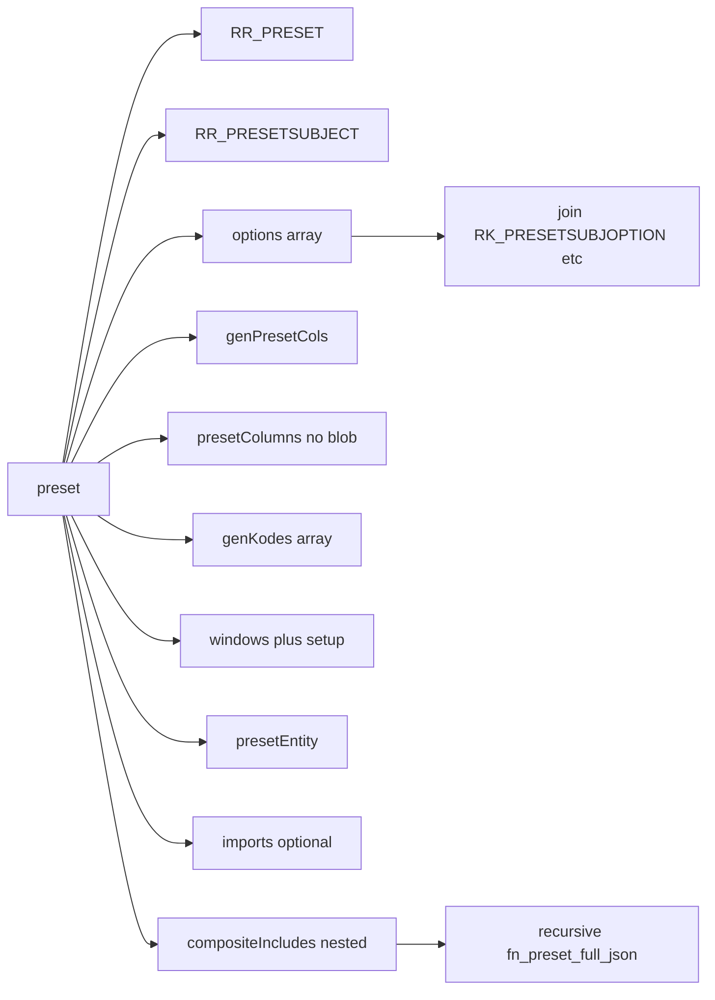

# Oracle function: full preset settings as JSON (`KOD_PRESET`)

## Context

- Schema and relationships are documented in [oracle-mcp/RR_PRESET_REFERENCE.md](oracle-mcp/RR_PRESET_REFERENCE.md). Live `ASUSE.RR_PRESET` / `RR_GEN_KODES` / `RR_PRESET_COLUMNS` match that doc (including **BLOB** `TABLE_STATE` on `RR_PRESET_COLUMNS`).
- **“Full” cannot mean the entire FK closure** (~1869 tables per the doc); the implementation targets the **report-configuration surface** around `RR_PRESET` plus **recursive** composite children.

## Design decisions (from you)

| Topic      | Choice                                                                                                                        |
| ---------- | ----------------------------------------------------------------------------------------------------------------------------- |
| Composites | **Recursive**: each `RR_PRESET_COMP` row (where `KOD_PRESET_COMP` = current preset) embeds full JSON for `KOD_PRESET_SIMPLE`. |
| BLOB       | **Omit** `TABLE_STATE`; export only identifying columns for `RR_PRESET_COLUMNS` (e.g. `KOD_PCOL`).                            |

## API shape (single package)

- **Deliverable**: new SQL script under the repo (no SQL files exist yet in [oracle-mcp/](oracle-mcp/) — e.g. [oracle-mcp/sql/pkg_rr_preset_json.sql](oracle-mcp/sql/pkg_rr_preset_json.sql)).
- **One package `ASUSE.PKG_RR_PRESET_JSON**`:
  - **Public** (spec): only what callers need — e.g. `FUNCTION fn_preset_full_json(p_kod_preset IN NUMBER, p_max_depth IN PLS_INTEGER DEFAULT 10) RETURN CLOB`.
  - **Private** (body only): JSON helpers (`json_escape_varchar2`, append key/value, append raw JSON fragment for recursion), `**preset_json_impl**` (or equivalent), and package-level `**VISITED**` associative array (`INDEX BY VARCHAR2(...)`, key `TO_CHAR(kod_preset)`) for cycle detection. Standalone functions cannot hold that mutable state cleanly; keeping helpers **inside this package** avoids extra schema objects and matches “only what we deploy.”
- **Internal flow**: `preset_json_impl` checks depth and visited, marks current `KOD_PRESET`, builds each section into a working CLOB, recurses for `RR_PRESET_COMP` children, unmarks when unwinding (or use a stack discipline — document the chosen rule).

## JSON document structure (logical)

Top-level object (names in `camelCase` or `snake_case` — pick one and stay consistent), roughly:

**Sections to implement (aligned with [RR_PRESET_REFERENCE.md](oracle-mcp/RR_PRESET_REFERENCE.md)):**

1. `**preset**` — row from `ASUSE.RR_PRESET` for `p_kod_preset` (all scalar columns; format `D_M` as ISO string if desired via `TO_CHAR`/`TIMESTAMP`).
2. `**subject**` — join `RR_PRESETSUBJECT` on `KOD_PSUBJ`.
3. `**options**` — rows from `RR_PRESETOPTION` for this preset, each enriched with definition fields from `RK_PRESETSUBJOPTION` (and optionally `RK_OPTION_TYPE.NAME`, `RK_PRESETFLTROPTION` for filter metadata). Preserve **multi-row** options (same `KOD_POPTION`, different `ORDNUM`) as separate array elements (or grouped by `KOD_POPTION` with a nested `values` array — choose one; grouped is often easier for consumers).
4. `**genPresetColumns**` — `RR_GEN_PRESET_COLS` for `KOD_PRESET` (all columns as in the table).
5. `**presetColumns**` — `RR_PRESET_COLUMNS` for `KOD_PRESET`: include `KOD_PCOL` only (no `TABLE_STATE`).
6. `**genKodes**` — all rows from `RR_GEN_KODES` for `KOD_PRESET` as a JSON array of objects (44 columns in your DB — mirror `ALL_TAB_COLUMNS`).
7. `**windows**` — `RR_PRESETWND` for preset, each with nested array from `RR_PRESETWNDSETUP` on `KOD_WND`.
8. `**presetEntity**` — `RR_PRESETENTITY` rows.
9. `**imports**` — `RR_IMPORT` where `KOD_PRESET` = preset (optional but listed in the reference as related).
10. `**compositeIncludes**` — for `RR_PRESET_COMP` where `KOD_PRESET_COMP = p_kod_preset`, each element: `KOD_INCL`, `KOD_PRESET_SIMPLE`, and `**nested**` = recursive full document for `KOD_PRESET_SIMPLE` (respect `p_max_depth`; on cycle or depth exceeded, emit a small stub object with `kodPreset` + `error` / `skippedReason` instead of recursing).

**Not in initial scope** (unless you expand later): subject-wide only tables (`RR_GEN_COLS`, `RR_SUBJOPTION`, `RR_COL_POPT`) as separate catalog blocks; other `KOD_PRESET`-bearing tables from doc §5 (`RR_COMPREP_*`, etc.).

## Implementation technique (Oracle 11.2, reference-DB only)

**Allowed dependencies** — use **only**:

- Oracle **built-in** PL/SQL and `**DBMS_LOB**` (and other standard supplied packages already present in 11.2, e.g. `**DBMS_OUTPUT**` only if needed for debug, not for production output).
- `**ASUSE**` tables/views that the compiling schema can already reference (same as application access to `RR_PRESET`, etc.). Do **not** require `**APEX_JSON**`, **WWV_** / **HTMLDB_** packages, **third-party PL/JSON**, or any object **not** present and executable on the **oracle-dev** database used in this project.

**Reference DB facts** (verified via oracle-dev MCP): **11.2.0.4**; `**APEX_JSON**` not in `all_objects` / `all_synonyms` for the MCP session; no APEX component row in `dba_registry` for `%APEX%`. The implementation is therefore **manual JSON only** — no conditional “if APEX exists” branch in shipped code unless you explicitly expand scope later.

**Inside `PKG_RR_PRESET_JSON` (private helpers)**:

- Escape strings for JSON (`\`, `"`, control chars → `\uXXXX` where needed).
- Append literals: `null`, numbers, booleans, quoted dates (`TO_CHAR` to ISO-like string).
- `**DBMS_LOB.APPEND**` to a session/working `**CLOB**`; avoid relying on `VARCHAR2` concatenation for the full document (32K limit).
- For **nested composite presets**: child `preset_json_impl` returns a **finished JSON object CLOB**; parent appends it after `"nested":` **without** passing it through the string escaper.

**Return type**: `**CLOB**`.

**Missing preset**: return `**NULL**` or a minimal JSON error object — choose one and document in the package header comment.

**Grants**: `GRANT EXECUTE ON ASUSE.PKG_RR_PRESET_JSON TO <app_role>;` as needed. Ensure compile-time access to all referenced `ASUSE` objects.

## Validation

- After install: `SELECT ASUSE.PKG_RR_PRESET_JSON.fn_preset_full_json(72631) FROM dual;` (sample id from [RR_PRESET_REFERENCE.md](oracle-mcp/RR_PRESET_REFERENCE.md)).
- Test a **composite** preset (includes via `RR_PRESET_COMP`) for nesting, **cycle**, and **max depth** behavior.
- Optional sanity check: `SELECT banner FROM v$version WHERE ROWNUM <= 1` matches expected 11.2 target.

## Doc follow-up (optional)

- Add a short §9 to [oracle-mcp/RR_PRESET_REFERENCE.md](oracle-mcp/RR_PRESET_REFERENCE.md) describing the function name, parameters, JSON shape, and recursion rules — only if you want the reference to stay the single source of truth.

