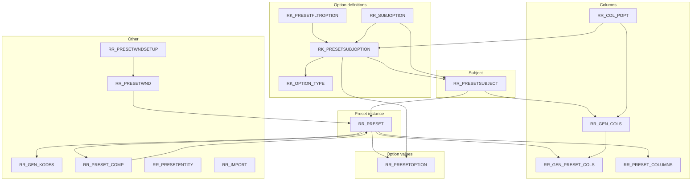

# ASUSE — `RR_PRESET` and related tables

**Schema:** `ASUSE`  
**Generated from:** Oracle data dictionary + sample `SELECT` queries (point-in-time; your DB may differ).

---

## 1. Overview — tables touching presets / report settings

| Table | Role | FK to `RR_PRESET` |
|--------|------|-------------------|
| `RR_PRESET` | Preset header (`KOD_PRESET` PK) | — |
| `RR_PRESETSUBJECT` | Report subject / template type (`KOD_PSUBJ`) | Parent of `RR_PRESET` |
| `RR_PRESETOPTION` | Saved option **values** per preset | Yes (`KOD_PRESET`) |
| `RR_PRESETOPTION_TMP` | Staging options | No (column only) |
| `RK_PRESETSUBJOPTION` | Option **definitions** per subject | No |
| `RK_OPTION_TYPE` | Option type dictionary | No |
| `RK_PRESETFLTROPTION` | Filter SQL / metadata for options | No |
| `RR_SUBJOPTION` | Subject ↔ allowed option definitions | No |
| `RR_GEN_COLS` | Column catalog per subject | No |
| `RR_GEN_PRESET_COLS` | Column visibility/format **per preset** | Yes |
| `RR_COL_POPT` | Links column (`NAME`) ↔ option (`KOD_POPTION`) | No |
| `RR_PRESET_COLUMNS` | UI table state (BLOB) | Yes |
| `RR_PRESET_COMP` | Composite preset includes simple preset | Yes (×2) |
| `RR_GEN_KODES` | Generator / grouping codes per preset | Yes |
| `RR_PRESETWND` | Window record per preset | No (column only) |
| `RR_PRESETWNDSETUP` | Key/value UI setup per window | No |
| `RR_PRESETENTITY` | Preset ↔ entity element | No (column only) |
| `RR_IMPORT` | Import jobs; optional `KOD_PRESET` | No (column only) |
| `RR_COMPREP_*` / `RR_GENCOMPREP_*` / `RR_GEN_*` (other) | Report gen / composite | Mostly no FK |
| `UR_LIST_OBLIGATOR` | Obligator list | No (column only) |

---

## 2. Entity relationship diagram



---

## 3. Foreign keys (declared) — quick reference

| From | Columns | To table | To columns |
|------|---------|----------|------------|
| `RR_PRESET` | `KOD_PSUBJ` | `RR_PRESETSUBJECT` | `KOD_PSUBJ` |
| `RR_PRESETOPTION` | `KOD_PRESET` | `RR_PRESET` | `KOD_PRESET` |
| `RR_PRESETOPTION` | `KOD_POPTION` | `RK_PRESETSUBJOPTION` | `KOD_POPTION` |
| `RR_GEN_PRESET_COLS` | `KOD_PRESET` | `RR_PRESET` | `KOD_PRESET` |
| `RR_GEN_PRESET_COLS` | `NAME` | `RR_GEN_COLS` | `NAME` |
| `RR_GEN_KODES` | `KOD_PRESET` | `RR_PRESET` | `KOD_PRESET` |
| `RR_PRESET_COLUMNS` | `KOD_PRESET` | `RR_PRESET` | `KOD_PRESET` |
| `RR_PRESET_COMP` | `KOD_PRESET_SIMPLE`, `KOD_PRESET_COMP` | `RR_PRESET` | `KOD_PRESET` |
| `RK_PRESETSUBJOPTION` | `KOD_PSUBJ` | `RR_PRESETSUBJECT` | `KOD_PSUBJ` |
| `RK_PRESETSUBJOPTION` | `KOD_OPTION_TYPE` | `RK_OPTION_TYPE` | `KOD_OPTION_TYPE` |
| `RK_PRESETFLTROPTION` | `KOD_POPTION` | `RK_PRESETSUBJOPTION` | `KOD_POPTION` |
| `RR_SUBJOPTION` | `KOD_PSUBJ` | `RR_PRESETSUBJECT` | `KOD_PSUBJ` |
| `RR_SUBJOPTION` | `KOD_POPTION` | `RK_PRESETSUBJOPTION` | `KOD_POPTION` |
| `RR_GEN_COLS` | `KOD_PSUBJ` | `RR_PRESETSUBJECT` | `KOD_PSUBJ` |
| `RR_COL_POPT` | `NAME` | `RR_GEN_COLS` | `NAME` |
| `RR_COL_POPT` | `KOD_POPTION` | `RK_PRESETSUBJOPTION` | `KOD_POPTION` |
| `RR_PRESETWNDSETUP` | `KOD_WND` | `RR_PRESETWND` | `KOD_WND` |

---

## 4. Columns by table

### 4.1 `RR_PRESET`

| Column | Type | Nullable | PK | Default | Notes |
|--------|------|----------|-----|---------|--------|
| `KOD_PRESET` | NUMBER(10) | N | Y | | Preset id |
| `KOD_PSUBJ` | NUMBER(10) | N | | | → `RR_PRESETSUBJECT` |
| `NAME` | VARCHAR2(200) | Y | | | Short name |
| `U_M` | VARCHAR2(20) | Y | | | Modified by |
| `D_M` | DATE | Y | | | Modified at |
| `PR_PROTECTED` | NUMBER(1) | Y | | | Protected flag |
| `TMP` | NUMBER(1) | Y | | | Temporary |
| `TITLE` | VARCHAR2(4000) | Y | | | Long title |
| `TYPE_APP` | NUMBER(10) | Y | | | App type |
| `PR_DEFAULT` | NUMBER(1) | Y | | | Default preset |

### 4.2 `RR_PRESETSUBJECT`

| Column | Type | Nullable | PK |
|--------|------|----------|-----|
| `KOD_PSUBJ` | NUMBER(10) | N | Y |
| `NAME` | VARCHAR2(200) | Y | |
| `INTNAME` | VARCHAR2(20) | N | |
| `TYPE_POTR` | NUMBER(1) | Y | |

### 4.3 `RR_PRESETOPTION`

| Column | Type | Nullable | PK | Default |
|--------|------|----------|-----|---------|
| `KOD_POPTION` | NUMBER(10) | N | | |
| `KOD_PRESET` | NUMBER(10) | N | | |
| `VAL_N` | NUMBER(20,2) | Y | | |
| `VAL_S` | VARCHAR2(250) | Y | | |
| `VAL_D` | DATE | Y | | |
| `ORDNUM` | NUMBER(5) | N | | `1` |
| `DT` | NUMBER(1) | Y | | |
| `OPER` | VARCHAR2(10) | Y | | |
| `VAL_N1` | NUMBER | Y | | |
| `VAL_S1` | VARCHAR2(50) | Y | | |
| `VAL_D1` | DATE | Y | | |
| `OPERNOT` | NUMBER(1) | Y | | |
| `OPEROR` | NUMBER(1) | Y | | |
| `VAL_SL` | VARCHAR2(254) | Y | | |
| `NUM` | NUMBER(10) | Y | | |

*No PK returned by dictionary tool; app may use composite uniqueness.*

### 4.4 `RK_PRESETSUBJOPTION`

| Column | Type | Nullable | PK |
|--------|------|----------|-----|
| `KOD_POPTION` | NUMBER(10) | N | Y |
| `KOD_PSUBJ` | NUMBER(10) | N | |
| `NAME` | VARCHAR2(200) | Y | |
| `INTNAME` | VARCHAR2(25) | N | |
| `KOD_OPTION_TYPE` | NUMBER | Y | | → `RK_OPTION_TYPE` |
| `DT` | NUMBER(2) | Y | | Value type hint |
| `FIELD` | VARCHAR2(30) | Y | | |
| `SKOD_ESYS` | VARCHAR2(100) | Y | | |
| `TEP_EL` | NUMBER | Y | | |
| `DT1` | NUMBER | Y | | |

### 4.5 `RK_OPTION_TYPE`

| Column | Type | Nullable | PK |
|--------|------|----------|-----|
| `KOD_OPTION_TYPE` | NUMBER(5) | N | Y |
| `NAME` | VARCHAR2(100) | N | |

### 4.6 `RK_PRESETFLTROPTION`

| Column | Type | Nullable | PK |
|--------|------|----------|-----|
| `KOD_POPTION` | NUMBER(10) | N | Y |
| `KOD_PSUBJ` | NUMBER(10) | Y | |
| `NAME` | VARCHAR2(200) | Y | |
| `IS_HIERARCHIC` | NUMBER | Y | |
| `SQL` | VARCHAR2(4000) | Y | LOV / filter query |

### 4.7 `RR_SUBJOPTION`

| Column | Type | Nullable | PK | Default |
|--------|------|----------|-----|---------|
| `KOD_PSUBJ` | NUMBER | N | Y (1) | |
| `KOD_POPTION` | NUMBER | N | Y (2) | |
| `PRIZN` | NUMBER | Y | | `0` |

### 4.8 `RR_GEN_COLS`

| Column | Type | Nullable | PK |
|--------|------|----------|-----|
| `NAME` | VARCHAR2(25) | N | Y* |
| `KOD_PSUBJ` | NUMBER(10) | N | |
| `TITLE` | VARCHAR2(100) | Y | |
| `DATATYPE` | VARCHAR2(20) | Y | |
| `FORMAT` | VARCHAR2(20) | Y | |
| `ALIGNMENT` | NUMBER(1) | Y | |
| `T_COLOR` | NUMBER(10) | Y | |
| `B_COLOR` | NUMBER(10) | Y | |
| `WIDTH` | NUMBER(3) | Y | |
| `PATTERN` | NUMBER(2) | Y | |
| `ORD` | NUMBER(10) | Y | |
| `VARNAME` | VARCHAR2(100) | Y | |
| `DECIMAL_PLACE` | NUMBER(2) | Y | |
| `COMPOSITE_TITLE` | NUMBER(1) | Y | |
| `SUM_TOTAL` | NUMBER(1) | Y | |
| `CYCLE_OP` | VARCHAR2(20) | Y | |
| `P_COLOR` | NUMBER(10) | Y | |
| `RABCOLS` | VARCHAR2(100) | Y | |
| `PR_RAB` | NUMBER(3) | Y | |
| `PR_TBL` | VARCHAR2(1) | Y | |

\*Dictionary reports PK on `NAME` only; rows are scoped by `KOD_PSUBJ` in practice.

### 4.9 `RR_GEN_PRESET_COLS`

Same shape as `RR_GEN_COLS` for display fields, plus:

| Column | Type | Nullable | PK |
|--------|------|----------|-----|
| `NAME` | VARCHAR2(25) | N | Y (1) |
| `KOD_PRESET` | NUMBER(10) | N | Y (2) |
| `KOD_PSUBJ` | NUMBER(10) | N | |

(Remaining columns mirror `RR_GEN_COLS`: `TITLE` … `PR_TBL`.)

### 4.10 `RR_COL_POPT`

| Column | Type | Nullable | PK |
|--------|------|----------|-----|
| `KOD_POPTION` | NUMBER(10) | N | Y (1) |
| `NAME` | VARCHAR2(25) | N | Y (2) |

### 4.11 `RR_PRESET_COLUMNS`

| Column | Type | Nullable | PK |
|--------|------|----------|-----|
| `KOD_PCOL` | NUMBER(10) | N | Y |
| `KOD_PRESET` | NUMBER(10) | N | |
| `TABLE_STATE` | BLOB | Y | Serialized grid state |

### 4.12 `RR_PRESET_COMP`

| Column | Type | Nullable | PK |
|--------|------|----------|-----|
| `KOD_INCL` | NUMBER(10) | N | Y |
| `KOD_PRESET_SIMPLE` | NUMBER(10) | N | | → included preset |
| `KOD_PRESET_COMP` | NUMBER(10) | N | | → composite preset |

### 4.13 `RR_PRESETWND`

| Column | Type | Nullable | PK |
|--------|------|----------|-----|
| `KOD_WND` | NUMBER(10) | N | Y |
| `KOD_PRESET` | NUMBER(10) | N | |
| `NAME` | VARCHAR2(200) | Y | |

### 4.14 `RR_PRESETWNDSETUP`

| Column | Type | Nullable | PK |
|--------|------|----------|-----|
| `KOD_WND` | NUMBER(10) | N | | → `RR_PRESETWND` |
| `KEY` | VARCHAR2(50) | Y | | |
| `VALUE` | VARCHAR2(200) | Y | | |

### 4.15 `RR_PRESETENTITY`

| Column | Type | Nullable | PK |
|--------|------|----------|-----|
| `KOD_PRESET` | NUMBER(10) | N | |
| `KOD_ELEMENT` | NUMBER(5) | N | |
| `KOD` | NUMBER(10) | Y | |

### 4.16 `RR_IMPORT`

| Column | Type | Nullable | PK |
|--------|------|----------|-----|
| `KOD_IMP` | NUMBER | N | Y |
| `KOD_IMP_PARENT` | NUMBER | Y | | self-FK |
| `KOD_TYPE` | NUMBER | Y | | → `RK_IMPORT_TYPE` |
| `KOD_PRESET` | NUMBER | Y | | logical link |
| `NAME` | VARCHAR2(250) | Y | |
| `U_M` | VARCHAR2(20) | Y | |
| `D_M` | DATE | Y | |

### 4.17 `RR_GEN_KODES` (abbrev.)

Wide denormalized row per preset / grouping context: `KOD_PRESET`, `KODP`, `NUMP`, `NAME`, `KOD_DOG`, `NDOG`, `NGR1`–`NGR6`, `SGR1`–`SGR6`, `NGRDOG1`–`NGRDOG6`, `SGRDOG1`–`SGRDOG6`, `INN`, `SATTR1`–`SATTR12`, `RAB`, etc. (44 columns total — use `ALL_TAB_COLUMNS` for full list).

---

## 5. Other tables with column `KOD_PRESET` (no FK to `RR_PRESET`)

Useful for complete exports; enforce joins in application or ad hoc SQL:

- `RR_PRESETOPTION_TMP`
- `RR_PRESETENTITY`
- `RR_PRESETWND`
- `RR_COMPREP_ROWS`, `RR_COMPREP_VALS`
- `RR_GENCOMPREP_ROWS`, `RR_GENCOMPREP_VALS`
- `RR_GEN_CALC_ZAD_ITOGI`, `RR_GEN_CALC_ZAD_T`
- `RR_GEN_CODES_T`, `RR_GEN_DIM_LEVEL`, `RR_GEN_DIM_TIME`, `RR_GEN_HEADERS`, `RR_GEN_OBJ_T`
- `UR_LIST_OBLIGATOR`

---

## 6. Sample data (live DB snapshots)

### 6.1 `RR_PRESET` (3 rows)

| KOD_PRESET | KOD_PSUBJ | NAME | U_M | D_M | PR_PROTECTED | TMP | TYPE_APP |
|------------|-----------|------|-----|-----|--------------|-----|----------|
| 36309 | 2 | ДАННЫЕ ПО ПЕРЕРАСЧЕТАМ | GALUSHKO | 2007-07-10 | 1 | | 1 |
| 12925 | 5 | SWI1 | SURAYVI | 2006-03-01 | 0 | | 1 |
| 72631 | 5 | СФ в электронном виде | MATSKOMV | 2012-01-27 | 1 | 0 | 1 |

### 6.2 `RR_PRESETSUBJECT` (5 rows)

| KOD_PSUBJ | NAME | INTNAME | TYPE_POTR |
|-----------|------|---------|-----------|
| 16 | Генератор задолженностей (быт, Казань) | genz_bytk | 2 |
| 15 | Составной отчет (пром) | compiled | 1 |
| 17 | Составной отчет (быт) | compiled_byt | 2 |
| 14 | Задолженность на дату | genz_dat | 1 |
| 6 | старый класс Генератор | clsFormGenOld | |

### 6.3 `RR_PRESETOPTION` for `KOD_PRESET = 72631` (with option `INTNAME`)

| KOD_POPTION | KOD_PRESET | VAL_N | VAL_S | VAL_D | ORDNUM | OPT_INTNAME |
|-------------|------------|-------|-------|-------|--------|-------------|
| 21 | 72631 | | 26-01-12 | 2012-01-25 | 1 | datend |
| 24 | 72631 | 39 | c_addr_ur | | 4 | props |
| 24 | 72631 | 37 | c_name | | 3 | props |
| 24 | 72631 | 320 | c_kpp | | 2 | props |
| 24 | 72631 | 36 | c_inn | | 1 | props |

*Same `KOD_POPTION` (`props`) can repeat with different `ORDNUM` / `VAL_*` (multi-value option).*

### 6.4 `RK_PRESETSUBJOPTION` (`KOD_PSUBJ = 5`, first row)

| KOD_POPTION | KOD_PSUBJ | NAME | INTNAME | KOD_OPTION_TYPE |
|-------------|-----------|------|---------|-----------------|
| 174 | 5 | Банк плательщика | gr_fin_bank_pl | 100 |

### 6.5 `RK_OPTION_TYPE` (10 rows)

| KOD_OPTION_TYPE | NAME |
|-----------------|------|
| 21 | Атрибуты договора(только пром) |
| 800 | Тип объектов для которых выбираются коды (везде) |
| 801 | Тип объектов для которых выбираются коды (каз-быт) |
| 1000 | Атрибуты объекта (казань-быт) |
| 1100 | Фильтр объекта |
| 1110 | Фильтр абонента |
| 1120 | Фильтр договора |
| 450 | Группировки по кодам дог.,аб. и т.п. |
| 101 | Группировки по деньгам (только пром) |
| 102 | Группировки по деньгам (только быт) |

### 6.6 `RR_SUBJOPTION` (`KOD_PSUBJ = 5`)

| KOD_PSUBJ | KOD_POPTION | PRIZN |
|-----------|-------------|-------|
| 5 | 3 | 0 |
| 5 | 4 | 0 |
| 5 | 5 | 0 |
| 5 | 7 | 0 |
| 5 | 8 | 0 |

### 6.7 `RR_GEN_COLS` (4 rows)

| NAME | KOD_PSUBJ | TITLE | DATATYPE | ORD |
|------|-----------|-------|----------|-----|
| nachisl_avans | 6 | Выставлено авансов | n | 1800020 |
| fio_founder | 6 | ФИО учредителя | s | 400100 |
| inn_founder | 6 | ИНН учредителя | s | 400105 |
| inn_dir | 6 | ИНН директора | s | 900150 |

### 6.8 `RR_COL_POPT` (4 rows)

| KOD_POPTION | NAME |
|-------------|------|
| 34 | numb |
| 35 | kod |
| 36 | inn |
| 37 | name |

### 6.9 `RK_PRESETFLTROPTION` (3 rows — `SQL` truncated)

| KOD_POPTION | KOD_PSUBJ | NAME |
|-------------|-----------|------|
| 691 | | Тип вывода |
| 693 | | Признак ССП |
| 614 | | Виды расчета (электричество) |

*(Full `SQL` text is in DB — VARCHAR2(4000).)*

### 6.10 `RR_PRESET_COMP` (5 rows)

| KOD_INCL | KOD_PRESET_SIMPLE | KOD_PRESET_COMP |
|----------|-------------------|-----------------|
| 717 | 69208 | 74432 |
| 657 | 29323 | 29324 |
| 697 | 90014959 | 90014960 |
| 737 | 2000089889 | 2000089891 |
| 740 | 20014207 | 20014209 |

### 6.11 `RR_IMPORT` (`KOD_PRESET` not null, 3 rows)

| KOD_IMP | KOD_PRESET | KOD_TYPE | NAME (truncated) |
|---------|------------|----------|------------------|
| 580 | 1 | 5 | Заливаем задолженности г Казань … |
| 582 | 1 | 5 | Заливаем счетчики абонентов … |
| 583 | 1 | 5 | Заливаем задолженности … |

---

## 7. Global FK closure

If you follow **every** foreign key from `RR_PRESET` in both directions, thousands of tables become reachable (see `rr_preset_closure_tables.txt` in this folder, ~1869 `ASUSE` tables). That is a **schema-wide** graph, not only report configuration.

---

## 8. Refreshing this document

Re-run column metadata (`ALL_TAB_COLUMNS` / describe) and sample queries for your environment. Example option-value sample:

```sql
SELECT po.*, so.INTNAME
FROM ASUSE.RR_PRESETOPTION po
JOIN ASUSE.RK_PRESETSUBJOPTION so ON so.KOD_POPTION = po.KOD_POPTION
WHERE po.KOD_PRESET = :kod_preset
  AND ROWNUM <= 20;
```
